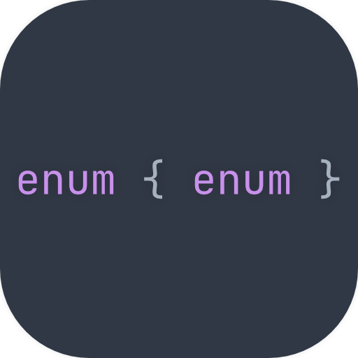
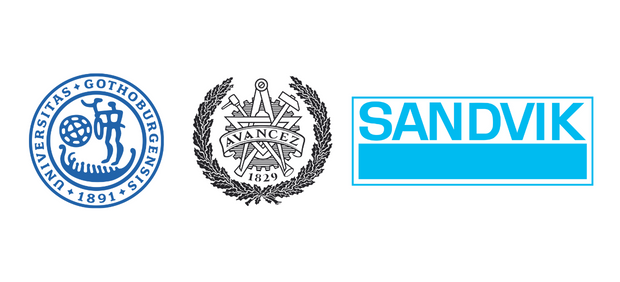

<h2 align="center">ActInSpace Hackathon 2022/2023</h2>

In late 2022, me and my fellow colleagues from the University of Gothenburg
and Chalmers competed in the [ActInSpace](https://actinspace.org/) hackathon.
Having won the **national** round in Sweden, we were invited to the
**international** round in Cannes, France. This repository captures the work we
did during the period of late 2022 to early 2023 as part of the competition.

**Thank you** [Sandvik](https://www.home.sandvik/en/) for the support; read
more about our efforts in the [press
release](https://www.home.sandvik/en/stories/articles/2023/03/waste-collecting-robot-at-hackathon/).

<h3>Final Product</h3>

The following is the **pitch slide deck** we presented at the international round of
the hackathon. [Click here](https://www.canva.com/design/DAFZ6CNneDE/view?embed#2)
to view the slide deck in its entirety. To read more about the project, please
visit our `React`-based website that we created for the purpose of the
competition [here](https://michalspano.com/doubleEnum/).

<h3>Acknowledgements</h3>

Additional thanks to [OpenHack Sweden](https://www.openhack.io/events/) for
their continued support. We furthermore express our gratitude to the
[University of Gothenburg](https://www.gu.se/) and [Chalmers University of
Technology](https://www.chalmers.se/) for their irreplacable assistance.

<code>DISCLAIMER</code> the current state of the <b>website</b> supports only
<b>desktop</b> platforms.
